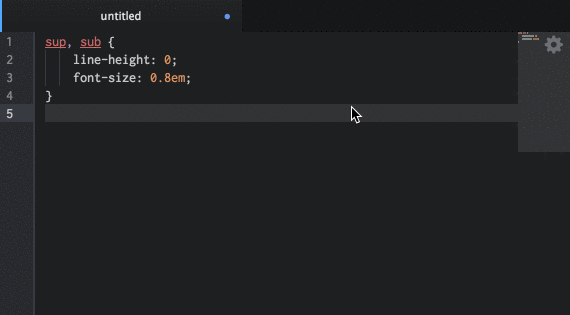

# [atom]-cssnano [][ci]

> Minify CSS with [cssnano].

## Install

```sh
apm install cssnano
```

## Usage



Open the Command Palette and enter `cssnano`. Alternately, use either the
context menus or `ctrl + alt + o` on your keyboard.

You can customise the output in the settings menu.

## Contributing

Pull requests are welcome. If you add functionality, then please add unit tests
to cover it.

## License

MIT © [Ben Briggs](http://beneb.info)

[atom]: https://atom.io
[cssnano]: http://cssnano.co

[ci]: https://travis-ci.org/ben-eb/atom-cssnano
